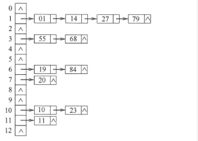

### 散列表


- 散列函数： 一个把查找表中的关键字映射成该关键字对于地址的函数

- 冲突： 散列函数肯会把两个或者两个以上的不同关键字映射到同一个地址，这种情况就叫冲突。

- 设计散列函数的注意点： 一方面要设计冲突尽可能少的散列函数，另一方面，冲突是不可避免的，所以还要设计处理冲突的方法。

- 散列表： 根据关键字而直接进行访问的数据结构，散列表建立了关键字和存储地址之间的一直映射关系。

- 在理想的情况下，散列表的时间复杂度为O(1)。 与表中的元素个数是无关的

#### 散列函数的构造方法

1. 散列函数的定义域必须包含全部的关键字， 而值域的范围则依赖于散列表的大小或地址范围
2. 散列函数计算出来的地址应该是等概率、均匀的分布在地址空间中。
3. 散列函数要尽可能的简单。

常用的散列函数：
- 直接定址法： 计算简单， 不会有冲突，适合关键字连续分布的情况。但是若关键字分布不连续， 会造成空间浪费。 H(key) = key 或者 H(key) = a * key + b
- 除留余数法： 最常用的方法，取一个不大于但是最接近散列表表长的质数m. H(key) = key % m
- 数字分析法: 
- 平方取中法: 取关键字的平方值的中间几位做为散列地址

#### 冲突的处理方法
所谓处理冲突是指在冲突发生之后，要有一种方法为产生冲突的关键字找到下一个空的hash地址。若是在寻找的过程中任然发生冲突就一直寻找下一个hash地址，直到不发生冲突为止。
1. 开放定址法：
    ```js
    H = (H(key) + d) % m       H(key)为散列函数， d 为 增量   m 为增量序列

    ```
  其中增量序列有以下四种取法：
  - 线性探测： 当冲突发生的时候，顺序查看表中的下一个地址，直到找到一个空闲的单元。 但是这样会造成大量的元素堆积在相邻的地址，降低了查找效率。
  - 平方探测法： d依次取 $0^2$, $1^2$, -$1^2$ ..., $k^2$, -$k^2$ 其中 K <= m / 2。 散列表的长度必须是一个表示为4K +3 的素数。
2. 拉链法：也就是书中的分离链接法
  为了避免冲突，可以将所有的关键字存储在一个线性链表中。

    

### 散列表查找效率
  散列表的查找效率取决于： 散列函数、冲突处理方法和填装因子
  填装因子 = 表中的记录数n / 散列表长度m
  散列表的平均查找长度依赖于散列表的填装因子，而不直接依赖于n m。填装因子越大，表示记录的越满，发生冲突的可能性就越大，反过来说填装因子越小，发生冲突的可能性越小。

  