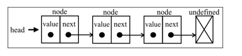
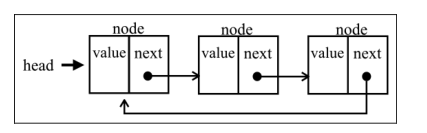
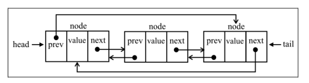

### linkedList 
不同于数组，链表中的元素在内存中并不是连续存放的。
每个元素由一个存储自身的节点和和指向下一个元素的引用组成。

与传统的数组相比，链表在删除或者添加元素的时候不需要移动其他的元素。但是链表需要指针
在数组中，我们可以访问任何位置的任何元素。但是链表不同，若是想在链表中访问一个元素，就需要从链表的表头开始查找直到找到元素。

### 循环链表
与链表的唯一区别就是循环链表的最后一个元素不是undefined了，而是指向第一个元素

### 双向循环链表
双向循环链表有指向head元素的tail.next和指向tail的head.prev
